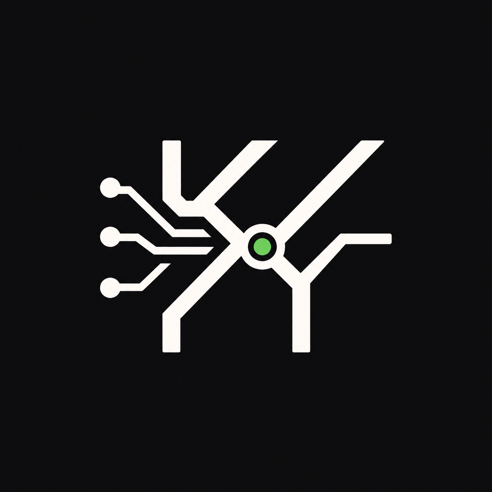

# KangYu · MadKangYu

**AI-agent operations, made observable and verifiable.**

I build and harden agent workflows where a model is not allowed to be “probably right.”
Every useful action needs evidence, permission boundaries, and a recovery path.

Current focus:

- agent runtime behavior and failure diagnosis
- CLI and operator tooling
- CI reliability and release hygiene
- human approval gates for automation
- knowledge systems around Obsidian and local-first operations

## Proof of work

- Reduced fallback log noise in [`NousResearch/hermes-agent`](https://github.com/NousResearch/hermes-agent/pull/5615), making runtime failures easier to diagnose.
- Improved Hermes CLI update flows so operators can move between versions with fewer surprises: [#7303](https://github.com/NousResearch/hermes-agent/pull/7303), [#7299](https://github.com/NousResearch/hermes-agent/pull/7299).
- Tightened documentation and runtime behavior so instructions match what the system actually does: [#7284](https://github.com/NousResearch/hermes-agent/pull/7284), [#7280](https://github.com/NousResearch/hermes-agent/pull/7280).
- Recovered failing CI by carrying baseline fixes across active PR branches and re-verifying with targeted test runs.

## Operating model

I treat useful automation as a gated decision system:

```text
signals -> evidence -> gates -> action -> verification
```

- **Signals** are raw observations: logs, API responses, screenshots, file diffs, test results.
- **Evidence** is structured enough to judge: source, value, confidence, freshness, authority, privacy boundary, action boundary, verification method, and blocker.
- **Gates** decide whether the next step is allowed: source, permission, parsing, privacy, local proof, runtime availability, external action, and verification.
- **Actions** are only promoted when the gate state supports them. Listed is not usable. Connected is not writable. Installed is not post-ready.

## Public work

| Area | Repository | What it shows |
| --- | --- | --- |
| Agent runtime | [`hermes-agent`](https://github.com/MadKangYu/hermes-agent) | Runtime signal quality, CLI update behavior, and CI reliability work against a real agent framework. |
| Design automation | [`figx`](https://github.com/MadKangYu/figx) | Pragmatic Figma CLI surface for macOS agent workflows and design handoff. |
| Design automation | [`MadKangYu-FigMa-Mcp`](https://github.com/MadKangYu/MadKangYu-FigMa-Mcp) | Figma MCP workflow notes for Claude Code and design-to-code automation. |
| Agent research | [`ai-agent-landscape`](https://github.com/MadKangYu/ai-agent-landscape) | Curated reference map of AI agent platforms, tools, and infrastructure. |
| Agent education | [`prompt-caching-slides`](https://github.com/MadKangYu/prompt-caching-slides) | Terminal-style explainer for Claude Code prompt caching lessons. |
| Messaging automation | [`kmsg-upstream-fork`](https://github.com/MadKangYu/kmsg-upstream-fork) | KakaoTalk CLI fork evaluated for macOS agent automation hooks. |

## What I optimize for

- Clear operator status instead of vague assistant prose
- Small reversible changes over broad rewrites
- Evidence-backed claims over inferred success
- Local-first workflows with explicit cloud escalation boundaries
- Source, working, and canonical layers kept separate

## Tools I use often

`Python` `TypeScript` `Shell` `GitHub Actions` `GitHub CLI` `Hermes` `Codex` `OpenCode` `Figma MCP` `Obsidian`

## Visual identity

<p align="left">
  
  
</p>

## Contact

- GitHub: [@MadKangYu](https://github.com/MadKangYu)
- Email available on request.
