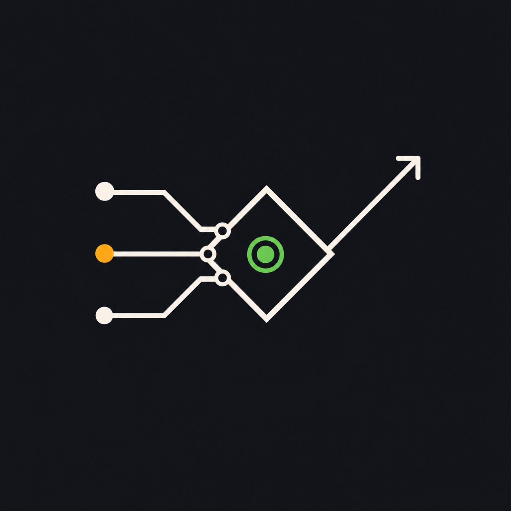

<p align="center">
  
</p>

# KangYu · MadKangYu

**Turning noise into verified action.**

I build verification-first workflows where AI amplifies human judgment.

I work on agent runtime behavior, operator tooling, CLI update flows, and CI reliability.

## Proof of work

- Made agent runtime failures easier to diagnose by reducing fallback log noise in [`NousResearch/hermes-agent`](https://github.com/NousResearch/hermes-agent/pull/5615).
- Improved CLI update flows so operators can move between versions with fewer surprises: [#7303](https://github.com/NousResearch/hermes-agent/pull/7303), [#7299](https://github.com/NousResearch/hermes-agent/pull/7299).
- Tightened documentation and runtime behavior so instructions match what the system actually does: [#7284](https://github.com/NousResearch/hermes-agent/pull/7284), [#7280](https://github.com/NousResearch/hermes-agent/pull/7280).
- Recovered failing CI by carrying baseline fixes across active PR branches and re-verifying them with targeted test runs.

## Focus

- AI agent runtime behavior
- CLI and operator tooling
- CI reliability and release hygiene
- Knowledge systems built around Obsidian

## Operating philosophy



- Memory fades; evidence remains.
- Automation is useful only when it is observable, recoverable, and accountable.
- AI should expand possibilities, while humans own the final verification gate.
- The goal is not speed by itself; the goal is verified forward motion.

## Operating model

I treat useful automation as a gated decision system:

```text
field values -> gate checks -> next action
```

- **Fields** capture the minimum structured evidence needed to judge a situation: source, observed value, confidence, freshness, authority, action boundary, privacy boundary, verification method, and blocker.
- **Gates** decide whether the next step is allowed: source, permission, parsing, privacy, local proof, runtime availability, external action, and verification.
- **Actions** are only promoted when the gate state supports them. Listed is not usable. Connected is not writable. Installed is not post-ready.

## Public work

- [`tiered-scraper`](https://github.com/MadKangYu/tiered-scraper) - turns fragile scraping into a staged, inspectable workflow with AI-assisted CAPTCHA handling.
- [`ai-agent-landscape`](https://github.com/MadKangYu/ai-agent-landscape) - maps major AI agent platforms and tools for faster comparison and research.
- [`prompt-caching-slides`](https://github.com/MadKangYu/prompt-caching-slides) - explains prompt caching and Claude Code in a presentation format.
- [`MadKangYu-FigMa-Mcp`](https://github.com/MadKangYu/MadKangYu-FigMa-Mcp) - documents a Figma MCP workflow for design-to-agent handoff.

`Python` `TypeScript` `GitHub Actions` `GitHub CLI` `GitLab CLI` `Hermes` `OpenClaw` `Obsidian`

## Contact

- GitHub: [@MadKangYu](https://github.com/MadKangYu)
- Email available on request.

<!-- Avatar candidate: ./assets/avatar-ky-signal-mark.png -->
